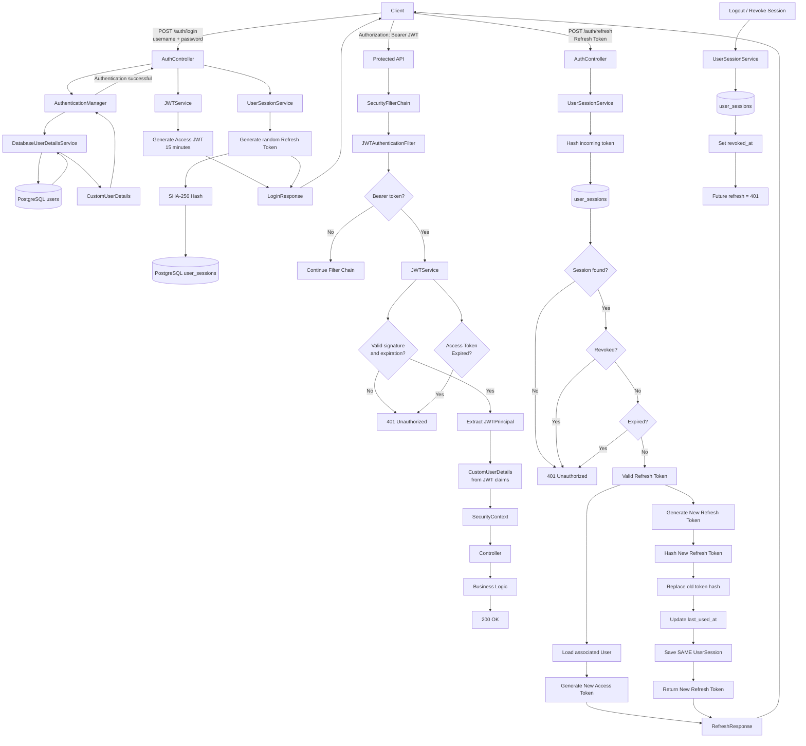

# Spring Boot Expense Tracker — Authentication & JWT

A Spring Boot expense tracker demonstrating modern backend practices, including **Spring Security, JWT authentication, refresh tokens, refresh-token rotation, PostgreSQL, Flyway, JPA, and stateless API security**.

The authentication system was intentionally built incrementally to understand what Spring Security is doing underneath its defaults rather than simply relying on auto-configuration.

---

## Authentication Architecture

The authentication system uses two types of tokens:

* **Access Token** — short-lived JWT used to access protected APIs.
* **Refresh Token** — long-lived, opaque token used to obtain a new access token.

The access token currently expires after **15 minutes**, while refresh sessions currently have a **30-day lifetime**.



---

## 1. Login

The client sends credentials to:

```http
POST /auth/login
Content-Type: application/json

{
  "username": "admin",
  "password": "********"
}
```

The request goes through Spring Security's `AuthenticationManager`.

```text
Client
  │
  │ username + password
  ▼
AuthController
  │
  ▼
AuthenticationManager
  │
  ▼
DatabaseUserDetailsService
  │
  ▼
UserRepository
  │
  ▼
PostgreSQL
  │
  ▼
CustomUserDetails
  │
  ▼
PasswordEncoder
```

If authentication succeeds, the application generates:

```text
Access Token
+
Refresh Token
```

The response looks conceptually like:

```json
{
  "accessToken": "...",
  "refreshToken": "..."
}
```

---

## 2. Access Token

The access token is a signed JWT.

The current claims are approximately:

```json
{
  "sub": "admin",
  "uid": "019f47ca-...",
  "role": "ADMIN",
  "iat": 1783893415,
  "exp": 1783894315
}
```

The token contains enough information for the application to reconstruct the authenticated user's security identity without querying the database on every API request.

### Why?

For a normal protected request:

```text
JWT
 │
 ▼
JWTAuthenticationFilter
 │
 ▼
Validate JWT
 │
 ▼
Extract JWTPrincipal
 │
 ▼
CustomUserDetails
 │
 ▼
SecurityContext
 │
 ▼
Controller
```

There is **no database lookup** in this path.

This is one of the major benefits of our JWT-based authentication design.

---

## 3. JWT Authentication Filter

The custom filter is registered before Spring Security's `UsernamePasswordAuthenticationFilter`:

```java
.addFilterBefore(
    jwtAuthenticationFilter,
    UsernamePasswordAuthenticationFilter.class
)
```

The filter:

1. Reads the `Authorization` header.
2. Checks for `Bearer`.
3. Validates the JWT.
4. Extracts the principal.
5. Creates `CustomUserDetails`.
6. Places the authentication into the `SecurityContext`.
7. Continues the filter chain.

Conceptually:

```text
Authorization: Bearer <JWT>
                │
                ▼
       JWTAuthenticationFilter
                │
                ▼
          JWTService
                │
        ┌───────┴───────┐
        │               │
      Invalid          Valid
        │               │
        ▼               ▼
       401       JWTPrincipal
                        │
                        ▼
                SecurityContext
```

---

## 4. Access Token Expiration

The access token is intentionally short-lived.

Current lifetime:

```text
15 minutes
```

After expiration:

```text
Client
  │
  │ expired JWT
  ▼
JWTAuthenticationFilter
  │
  ▼
JWTService
  │
  ▼
Token expired
  │
  ▼
401 Unauthorized
```

The client does **not** need to ask the user for their password again.

Instead, it can use the refresh token.

---

# 5. Refresh Token

Unlike the access token, the refresh token is an **opaque random value**.

Example:

```text
068qm1ObvWUe4XGiWx-7TQyyoNfKRc5HvBuU39eVv4s
```

The server does not store this raw value.

Instead:

```text
Raw Refresh Token
        │
        ▼
     SHA-256
        │
        ▼
refresh_token_hash
```

The database contains something like:

```text
9147865562814002bde65322ba00e55cd96cbb45dbfc817c2e6dba5ff1ab4374
```

This means a database compromise does not immediately expose usable refresh tokens.

---

# 6. User Sessions

Refresh tokens are associated with persistent sessions.

Current table:

```text
user_sessions

id
user_id
refresh_token_hash
user_agent
ip_address
created_at
last_used_at
expires_at
revoked_at
```

A session represents a **login/device session**, rather than every individual refresh-token generation.

For example:

```text
User #1

Session #1 → Chrome
Session #2 → Phone
Session #3 → Tablet
```

This allows individual sessions to be revoked.

For example:

```text
Chrome  → revoked
Phone   → active
Tablet  → active
```

---

# 7. Multiple Simultaneous Sessions

A user can have multiple refresh tokens simultaneously.

```text
                    User
                     │
        ┌────────────┼────────────┐
        ▼            ▼            ▼
     Chrome        Phone        Tablet
        │            │            │
   Session #1    Session #2    Session #3
        │            │            │
   Refresh A     Refresh B     Refresh C
```

This is important for session management.

Logging out from Chrome does not have to invalidate the user's phone session.

---

# 8. Refresh Flow

When the access token expires:

```http
POST /auth/refresh
Content-Type: application/json

{
  "refreshToken": "..."
}
```

The server:

```text
Refresh Token
      │
      ▼
SHA-256
      │
      ▼
Find UserSession
      │
      ├── Not found ──► 401
      │
      ├── Revoked ────► 401
      │
      ├── Expired ────► 401
      │
      ▼
Valid Session
      │
      ▼
Associated User
      │
      ▼
Generate New Access Token
```

---

# 9. Refresh Token Rotation

Refresh tokens are **rotated** after successful use.

Suppose the client currently has:

```text
Refresh Token A
```

The database contains:

```text
hash(A)
```

After a successful refresh:

```text
Refresh A
    │
    ▼
Validate
    │
    ├──────────────► New Access Token
    │
    ▼
Generate Refresh B
    │
    ▼
Hash B
    │
    ▼
Replace hash(A)
with hash(B)
```

The same `UserSession` remains:

```text
Before:

Session #1
refresh_token_hash = hash(A)


After:

Session #1
refresh_token_hash = hash(B)
```

The session itself is not recreated.

---

# 10. Why Rotation Matters

Without rotation:

```text
Refresh A
   │
   ├── refresh ──► Access B
   │
   ├── refresh ──► Access C
   │
   └── refresh ──► Access D
```

Refresh token A remains usable for its entire lifetime.

With rotation:

```text
Refresh A
   │
   ▼
Refresh B
   │
   ▼
Refresh C
   │
   ▼
Refresh D
```

Each refresh token is intended to be used once.

Therefore:

```text
A → B
```

means the old `A` is no longer valid.

---

# 11. Refresh Token Reuse

Rotation also gives us an important security signal.

Suppose an attacker steals Refresh Token A.

Both the legitimate client and attacker possess:

```text
Refresh A
```

If the attacker uses it first:

```text
Attacker
   │
   │ Refresh A
   ▼
Server
   │
   ▼
A → B
```

The legitimate client still has A.

If it later sends A:

```text
Refresh A
   │
   ▼
Server
   │
   ▼
hash(A) no longer exists
   │
   ▼
401 Unauthorized
```

This can eventually become **refresh-token reuse detection**.

A previously valid token being presented again can indicate that a token was stolen.

The next security enhancement is therefore:

```text
Refresh Token Reuse Detection
            │
            ▼
Possible Token Theft
            │
            ▼
Revoke Session / Token Family
```

---

# 12. Session Revocation

A session can be revoked by setting:

```text
revoked_at = CURRENT_TIMESTAMP
```

For example:

```sql
UPDATE user_sessions
SET revoked_at = CURRENT_TIMESTAMP
WHERE id = 1;
```

The refresh token associated with that session can no longer be used.

```text
Refresh Token
      │
      ▼
UserSession
      │
      ▼
revoked_at != NULL
      │
      ▼
401 Unauthorized
```

---

# 13. Authentication vs Authorization

The project also distinguishes between authentication and authorization.

### Authentication

> "Who are you?"

Examples:

```text
Username + Password
JWT
Refresh Token
```

Failure:

```http
401 Unauthorized
```

### Authorization

> "Are you allowed to do this?"

For example:

```text
Authenticated user
        │
        ▼
ROLE_USER
        │
        ▼
Admin-only endpoint
        │
        ▼
403 Forbidden
```

This distinction is important when working with Spring Security.

---

# 14. Spring Security Responsibilities

The application intentionally separates responsibilities.

```text
Spring Security
│
├── Authentication
│   ├── AuthenticationManager
│   ├── UserDetailsService
│   └── PasswordEncoder
│
├── JWT authentication
│   └── JWTAuthenticationFilter
│
├── Authorization
│   ├── SecurityContext
│   ├── Roles
│   └── @PreAuthorize
│
└── HTTP security failures
    ├── 401 Unauthorized
    └── 403 Forbidden
```

Meanwhile, application-level exceptions are handled separately:

```text
GlobalExceptionHandler
│
├── ResourceNotFoundException → 404
├── ValidationException       → 400
├── BusinessRuleException     → 409
└── Other application errors
```

This keeps security infrastructure separate from business-domain error handling.

---

# 15. Stateless API

The application uses:

```java
.sessionManagement(session ->
    session.sessionCreationPolicy(
        SessionCreationPolicy.STATELESS
    )
)
```

Therefore the server does not use an HTTP session to maintain authentication state.

The authentication state is represented by:

```text
Access JWT
```

while long-lived authentication continuity is represented by:

```text
Refresh Token + UserSession
```

This is why the application can remain stateless for normal API authentication while still supporting long-lived login sessions.

---

# 16. Complete Lifecycle

The complete lifecycle can be summarized as:

```text
                    ┌──────────────┐
                    │    LOGIN     │
                    └──────┬───────┘
                           │
               username + password
                           │
                           ▼
                  AuthenticationManager
                           │
                           ▼
                 DatabaseUserDetailsService
                           │
                           ▼
                      User Database
                           │
                           ▼
                    Authentication OK
                           │
             ┌─────────────┴─────────────┐
             ▼                           ▼
       Access Token                 Refresh Token
        15 minutes                    30 days
             │                           │
             ▼                           ▼
        API Requests                UserSession
             │                           │
             ▼                           ▼
     JWTAuthenticationFilter        PostgreSQL
             │                           │
             ▼                           │
      Validate JWT                       │
             │                           │
        ┌────┴────┐                      │
        ▼         ▼                      │
     Valid      Expired                  │
        │         │                      │
        ▼         ▼                      │
 SecurityContext  401                    │
        │                                │
        ▼                                │
    Controller                           │
        │                                │
        ▼                                │
      200 OK                             │
                                         │
                                  Access token expires
                                         │
                                         ▼
                                  /auth/refresh
                                         │
                                         ▼
                                  Validate session
                                         │
                              ┌──────────┴──────────┐
                              ▼                     ▼
                           Invalid                Valid
                              │                     │
                              ▼                     ▼
                             401              Rotate token
                                                    │
                                       ┌────────────┴────────────┐
                                       ▼                         ▼
                                New Access JWT             New Refresh Token
                                       │                         │
                                       └────────────┬────────────┘
                                                    │
                                                    ▼
                                                 Client
                                                    │
                                                    ▼
                                                Repeat
```

---

## Current Authentication Stack

```text
Spring Boot
    │
    ├── Spring Security
    │
    ├── JWT
    │
    ├── PostgreSQL
    │
    ├── Spring Data JPA
    │
    └── Flyway
```

### Security components

```text
auth/
├── AuthController
│
├── config/
│   ├── SecurityConfig
│   ├── AdminBootstrapConfiguration
│   └── AdminBootstrapProperties
│
└── security/
    ├── JWTAuthenticationFilter
    ├── JWTService
    ├── JWTPrincipal
    ├── CustomUserDetails
    ├── CustomUserDetailsMapper
    ├── DatabaseUserDetailsService
    ├── RefreshTokenGenerator
    ├── RefreshTokenHasher
    └── UserSessionService
```

---

## Authentication Goals

This implementation intentionally demonstrates the following principles:

* Stateless REST authentication
* Short-lived access tokens
* Long-lived refresh tokens
* Refresh-token hashing
* Refresh-token rotation
* Per-device/session authentication
* Session-level revocation
* JWT authentication without a database lookup on every request
* Database lookup during initial credential authentication
* Separation of authentication and authorization
* Separation of Spring Security errors from business exceptions
* Explicit Spring Security configuration instead of relying entirely on defaults

---

## Roadmap

The authentication system is being developed incrementally.

### Completed

* [x] Spring Security configuration
* [x] Disable form login
* [x] Disable HTTP Basic
* [x] Stateless sessions
* [x] Database-backed `UserDetailsService`
* [x] Password authentication
* [x] Custom `UserDetails`
* [x] JWT generation
* [x] JWT validation
* [x] JWT authentication filter
* [x] Access-token expiration
* [x] JWT authentication without DB lookup
* [x] Refresh-token generation
* [x] Hashed refresh-token storage
* [x] Persistent user sessions
* [x] Multiple simultaneous sessions
* [x] Session-level revocation
* [x] `/auth/refresh`
* [x] Refresh-token rotation

### Next

* [ ] Refresh-token reuse detection
* [ ] Rotation/concurrency hardening
* [ ] Logout endpoint
* [ ] Revoke individual sessions
* [ ] Revoke all sessions
* [ ] Session management API
* [ ] Further authentication/security hardening
* [ ] Additional authorization rules

---

## Core Idea

The most important concept behind the architecture is:

```text
Password
   │
   └── used during LOGIN

Access Token
   │
   └── used for normal API requests

Refresh Token
   │
   └── used to obtain new access tokens

UserSession
   │
   └── controls long-lived authentication,
       device sessions, rotation, and revocation
```

The result is a system where **normal API requests are fast and stateless**, while long-lived authentication remains **revocable and manageable through persistent refresh-token sessions**.
